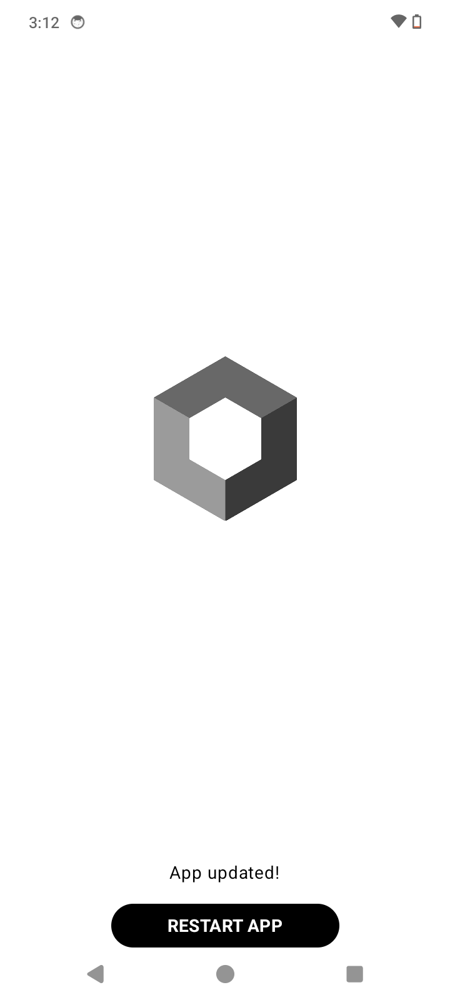

# 💳 Rehive Pay

Rehive Pay is a modern Android mobile wallet application. It serves as a comprehensive digital wallet, featuring a highly interactive user interface built entirely with Jetpack Compose.

## 📱 App Demo
<p align="center">
  
</p>


## 📱 Features & Core Screens

1. **🔐 Authentication & Session Management**
   - **Credentials Flow:** Seamless Sign In and Sign Up pages with live error validation.
   - **Persistent Sessions:** State is saved using DataStore Preferences, keeping the user logged in across app relaunches.

2. **🏠 Smart Dashboard**
   - **Wallet Overview:** Quick access to main balances and recent activity.
   - **Quick Actions:** Easy access to core actions like transfers and deposits.

3. **💳 Cards Management**
   - **Card Overview:** View and manage linked debit/credit cards.

4. **💸 Transfer & Deposit**
   - **Send Money:** Securely transfer funds to other users.
   - **Deposit Funds:** Add money to the wallet efficiently.

5. **👤 User Profile & Settings**
   - **Profile Management:** View and edit user details.
   - **App Customization:** Settings configuration tailored to user preferences.

## 🛠️ Architecture & Tech Stack

The application leverages the best practices of modern Android development:

| Component | Library / Framework | Description |
| :--- | :--- | :--- |
| **UI Framework** | **Jetpack Compose** | Declarative UI rendering for modern native Android. |
| **Navigation** | **Navigation Compose** | In-app navigation for Compose. |
| **Dependency Injection** | **Koin** | Lightweight dependency injection framework. |
| **Local Settings** | **DataStore** | DataStore Preferences for local key-value persistence. |
| **Networking** | **Retrofit & OkHttp** | Type-safe HTTP client for async networking. |
| **Concurrency** | **Coroutines** | Kotlin Coroutines for asynchronous operations. |

## 🚀 How to Run the Application

### Prerequisites
- Android Studio (latest stable version recommended)
- JDK 11+ (or JDK 17 as standard)

### 🤖 Running the App
1. Clone or open the repository in Android Studio.
2. Allow Gradle to sync and download all dependencies.
3. Select the `app` configuration in the run configurations dropdown.
4. Select your target emulator or physical device.
5. Click the **Run** button (Shift + F10) or run the following Gradle command from the root directory:

   ```bash
   ./gradlew :app:installDebug
   ```

## 📂 Project Structure

```text
.
├── app/                  # Main application module
│   ├── src/
│   │   ├── main/
│   │   │   ├── java/com/example/rehive_pay/
│   │   │   │   ├── base/      # Base classes
│   │   │   │   ├── data/      # Data layer (repositories, data sources)
│   │   │   │   ├── feature/   # App features (auth, cards, dashboard, deposit, etc.)
│   │   │   │   ├── navigation/# Navigation setup and routes
│   │   │   │   └── ui/        # Shared UI components and theme
│   │   │   └── AndroidManifest.xml
│   └── build.gradle.kts  # App-level build script
└── build.gradle.kts      # Project-level build script
```

## 🔒 Form Validation Logic
Authentication fields on the Login and Sign Up forms have strict validations.
Required fields will show visual validation borders and error texts upon submission if left blank or improperly formatted.

## 📡 API Layer Integration
Networking is handled via Retrofit with OkHttp, with asynchronous operations powered by Kotlin Coroutines.
